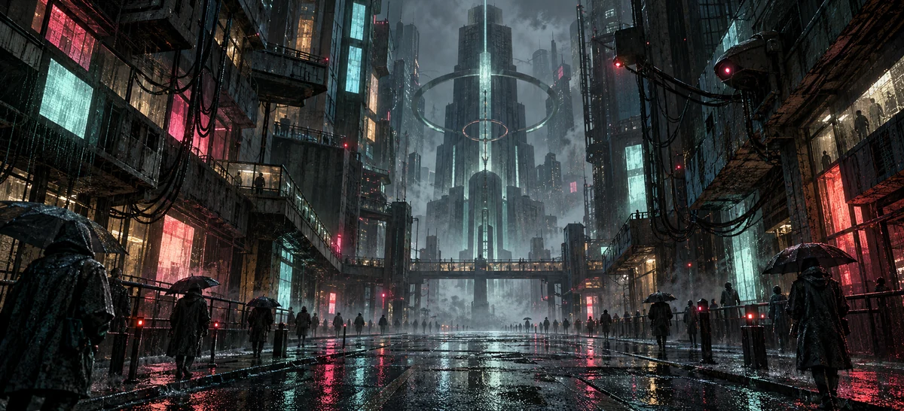

# SCHISM

**The train ends here. The city owes you nothing.**



A persistent dystopian city RPG about ordinary people surviving an indifferent system. Arrive with no money, no allegiance, and a civic ID. Work the foundry, climb into administration, open a shop, or disappear into the underground. Your neighbors change the city you all have to live in.

[Play SCHISM](https://schism.williamschultz903.chatgpt.site) · [Gameplay rules](docs/GAMEPLAY.md) · [Architecture](docs/ARCHITECTURE.md) · [Session handoff](SESSION_HANDOFF.md)

The hosted game currently retains its owner-private audience. Sign-in and separate persistent characters support additional authorized citizens when access is expanded. This is an asynchronous multiplayer RPG: shared markets, district conditions, projects, trades, and notices, with timed individual activities.

## Arrive as someone

ChatGPT sign-in creates a durable account. Register one character: choose a name, gender, six skin tones, six hair colors, five hairstyles, and three builds. The same layered painted character portrait appears in your papers, loadout, and overview. These choices are cosmetic and can be updated later. Administration and security issue earned uniforms that appear when equipped.

Every arrival comes by an import train into the **current** Ninth Stratum. New citizens start neutral with **0 credits**, worn equipment, and a bunk for one city cycle.

The owner requested a fresh start after the residency update. On October 5, 2026, all existing characters and their personal records were reset once. Sign in again to create a new citizen under the harsher rules. The shared city clock, market, faction balance, repair projects, and completed district contributions continue. Future updates retain character progress.

## A clock you cannot outrun

| Clock | Duration |
| --- | --- |
| City hour | 15 real minutes |
| Shared city day / cycle | 6 real hours |
| Days in the city | Whole 24-hour days since character registration |
| Regular memory-sorting shift | 30 real minutes |
| Full sleep | 90 real minutes; once per city day |

A job reserves energy and completes in the background. Pay, career XP, and benefits arrive at its deadline. Sleeping restores energy over time. Neither action fast-forwards the city. A permit allows **eight work hours per city day**. Hunger, cold, rent, and tax deadlines continue while you are away.

## A few minutes in the city

Long shifts have company now. Take **20–75 second** tasks: search municipal bins, strip dead electronics, clean public terminals, decode stray signals, and repair heating relays. Spend energy to recover fabric, copper, circuit parts, and signal traces. Ten short tasks per city cycle keep this from becoming an endless credit faucet.

A separate short-task slot supports work breaks during ordinary shifts. Street scavenging requires you to be off duty. Craft warming packs, clean dressings, neural patches, and rebuilt relay fragments from what you find. Ingredients and energy are spent upfront; the item arrives when the timer ends.

The **civic neural network** has persistent District IX, Exchange, and Uncounted chat channels. Public freight contracts and hidden Wound deliveries turn signal traces into small rewards and shared city consequences. The **Null House** offers four 20-second hands per cycle: stake 1–3 CR, spend 6 energy, and face a 45% chance of a double return.


## Obey, and still struggle

**Revenue collects 12% of reported earned income.** Tax accumulates in a separate ledger; the player must pay it before the deadline. Fractional amounts carry forward so splitting small earnings cannot avoid tax.

An overdue account flags the citizen ID. Factory gates refuse flagged citizens. Debt payment does not erase the flag: Registry review takes a fee, time, and energy. An indigence appeal substitutes a longer wait for the fee. Public custodial work stays open to earn debt money. A daily emergency meal helps an exhausted, broke citizen recover enough to act.

Rent starts after one six-hour arrival grace period. Four unpaid bills mean eviction. Better housing costs deposits and higher rent, but protects warmth and improves sleep. A heated apartment requires two real days of residency and civic trust.

## Choose a life

- **Factory and field work:** four career paths, twelve jobs, regular/overtime/graveyard shifts, equipment effects, and ranks at 24, 80, and 180 XP. Three shifts on a path earn a once-per-day 3-credit quota bonus.
- **Administration:** at least two real days in the city, 25 trust, 80 civic XP, low heat, a cleared ID, and a 60-credit application fee.
- **Trade:** buy and sell directly with other citizens. After one real day and 10 trust, a 90-credit license unlocks a shop. Stock is consumed to earn taxable sales; simulated foot traffic supports two sessions per city day.
- **Security:** seven real days, 30 completed shifts, 60 trust, 180 civic XP, Order +40, low heat, and a cleared ID. Patrols contribute to easing district lockdowns.
- **Crime:** three operations per city day. Unreported earnings avoid Revenue. Success builds underground reputation and pulls alignment toward Chaos. Arrest means fines, injury, detention, and an ID hold that needs Registry clearance.

Five branching personal stories remember your choices and relationships. The Canon and the Wound compete through personal allegiance and a shared Order/Chaos balance. Cooperative lattice repairs protect the whole district.

## Your neighbors can make tomorrow worse

District events show their causes and their effects. They respond to completed player activity, including shifts whose owner has not returned yet.

| What citizens do | What the district does |
| --- | --- |
| Neglect factory production | Food costs more; shift wages fall |
| Restore printer output | Food costs less; common stock grows |
| Leave the relief train unloaded | Border surcharge raises food prices |
| Complete freight work | Lift the surcharge and deliver common food stock |
| Complete criminal operations | Trigger a lockdown and stronger checkpoint scrutiny |
| Organize through the Uncounted | Win higher wages, draw additional scrutiny |
| Run communal boilers | Reduce cold exposure for everyone |
| Serve on security patrols | Counter criminal pressure and lift lockdowns |

Weather fronts, identity sweeps, shared food stock, faction effects, and the thermal lattice add further pressure. Survival is a budget of time, energy, credits, and compliance.

## Run locally

Requires Node **22.20 or newer**.

```sh
npm ci
npm test
npm run build
npm run validate
npm run dev
```

The development game runs at `http://127.0.0.1:4173`, uses a local QA identity, and stores one shared city in ignored `.local-data/city.sqlite`. Each browser receives a separate signed local session. Production uses Sites identity and durable D1 storage. Local characters persist across server restarts. Set `SCHISM_TAILSCALE_IP` to bind the same city to your Tailscale address as well as loopback; see [local hosting](docs/LOCAL_HOSTING.md). Rebuild and restart development after changing source.

**272 checks** cover registration, timed settlement, survival, branching stories, shared-stock and player-trade races, equipment, careers, fractional income tax, factory holds, administrative clearance, relief, arrests, late security progression, shared event causes, legacy saves, the one-time reset's cleanup, rollback, and retry safety, and short activities/crafting/network/casino rules. Desktop and mobile browser checks cover character creation/editing, all screens, and assignment persistence. See the handoff for verification evidence.

## Source and hosting

Vanilla HTML/CSS/JavaScript and a Cloudflare Worker; no client framework. The Worker owns every balance, permit, flag, queue, inventory item, and city contribution. SQLite transactions and optimistic version guards protect shared purchases and trades, duplicate actions, and activity completion. Drizzle owns schema migrations.

```text
worker/       Simulation, identity rules, stories, factions, city events
public/       Terminal UI, composed character art, original city assets
scripts/      Build, local D1 adapter, development server, gameplay checks
db/           Drizzle schema
drizzle/      Append-only production migrations
docs/         Gameplay and architecture reference
```

Build emits a Worker module with embedded interface and 23 WebP assets, including cropped portrait layers, plus D1 migrations. Publishing uses the **Sites building and hosting skills** and preserves the existing Site and audience. Production requires the trusted `oai-authenticated-user-id` header forwarded by Sites. No browser-provided identity or balances are trusted.

## Original artwork

The rainy city banner above is part of SCHISM’s original artwork. The original five generated scene assets depict the city, foundry, exchange, rainline, and worker archetype. Prompts and provenance live in [occult-provenance.json](art/occult-provenance.json) and [noir-provenance.json](art/noir-provenance.json). Eight new generated assets add seven city scenes and a transparent painted portrait kit. Ten cropped head/hair/uniform components compose the customizable portrait. New prompts and asset provenance live in [street-prompts.json](art/street-prompts.json) and [street-provenance.json](art/street-provenance.json). Mobile and desktop playtest findings are recorded in [the v0.6 critique](docs/playtests/V0.6.md).

Browser agent tools are feature-detected. Native WebMCP registration remains unverified because the available QA browser does not support it.
