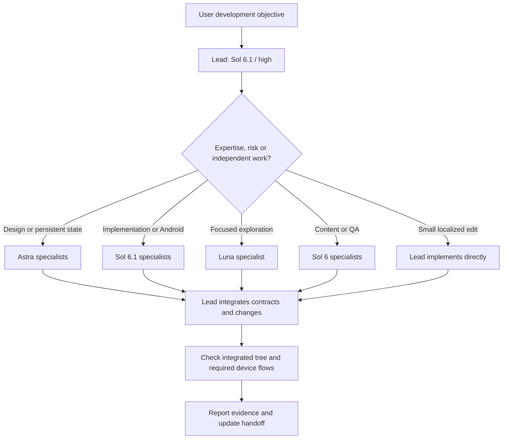

# SCHISM native Codex development team

Start Codex in this repository, give it a development objective, and let the lead
select specialists. Small localized work stays with the lead. The team preserves
the existing Godot architecture, project rules, asset provenance and release
workflow. It develops user-assigned work; this configuration does not run an
unattended service or invent a backlog.

## Installed capability and official research

Researched on 2026-10-08 against **codex-cli 0.161.0** at
`/home/commander/.local/bin/codex`. The signed-in native account catalog advertises
`gpt-6.1-sol`, `gpt-6-astra`, `gpt-6-sol`, `gpt-6-luna`, and `gpt-5.6-sol`.
All four configured families advertise the chosen medium/high reasoning efforts.
Availability is account-specific; the checker verifies the actual catalog rather
than assuming an API model name grants Codex access.

Current [official subagent documentation](https://learn.chatgpt.com/docs/agent-configuration/subagents)
supports standalone project `.codex/agents/*.toml` files with `name`, `description`
and `developer_instructions`, plus per-agent `model` and
`model_reasoning_effort`. `[agents]` controls enablement, defaults and concurrent
child threads. Named custom-agent files take precedence over spawn/default model
settings. The lead chooses which specialist to call; there is no documented
task-keyword routing table. SCHISM's routing policy is in AGENTS.md.

[Official configuration guidance](https://learn.chatgpt.com/docs/config-file/config-basic)
requires project trust before loading `.codex/config.toml`. Trust belongs in the
machine's user config, not the repository. CLI/client choices and managed policy
can override project defaults.

[Official model guidance](https://learn.chatgpt.com/docs/models) describes model
selection in the client and Ultra reasoning for proactive multi-agent work. Here
the lead remains at the requested **high** effort; AGENTS.md explicitly requests
automatic delegation, satisfying the installed runtime's instruction that
delegation needs an explicit user/project request. The deprecated app-server
`multiAgentMode` parameter is ignored in this installed version; we do not rely
on it or an obsolete `features.multi_agent` switch.

The [official app-server protocol](https://learn.chatgpt.com/docs/app-server)
provides `config/read`, `model/list`, and session inspection. The checked-in
validator uses those native endpoints; it never starts model turns or dispatches
work. Live delegation is exercised separately with the native CLI and collaboration
tools. No external orchestration framework, API credentials or runtime dependency
is added.

## Team and responsibility

| Role | Model | Effort | Primary scope |
| --- | --- | --- | --- |
| Lead (primary session) | `gpt-6.1-sol` | high | Plan, assign ownership, integrate, verify, update HANDOFF |
| `schism_architecture` | `gpt-6-astra` | high | Authority boundaries, interfaces, schema decisions |
| `schism_gameplay` | `gpt-6.1-sol` | medium | Commands, jobs, needs, housing, physical interactions |
| `schism_economy_persistence` | `gpt-6-astra` | high | Money, custody, settlement, migration, save recovery |
| `schism_exploration` | `gpt-6-luna` | medium | Read-only call paths, file maps, documentation research |
| `schism_world_content` | `gpt-6-sol` | medium | District IX locations, objects, catalogs, assets/provenance |
| `schism_android` | `gpt-6.1-sol` | high | Touch, lifecycle, Compatibility rendering, measured performance |
| `schism_qa` | `gpt-6-sol` | high | Independent review, regressions, build/device evidence |

Android was not assigned a model in the request. Sol 6.1/high is the project choice
for lifecycle/rendering work. Exploration uses the permitted medium effort;
QA uses the permitted high effort. The default unnamed child is Sol 6.1/medium.
Each specialist file pins both model and effort, preventing accidental inheritance
of the lead's effort. There is no redundant lead subagent: project config selects
the primary lead session.



## Delegation and file ownership

The lead sends a focused task containing the objective, accepted contracts,
readable/writable paths, acceptance criteria and expected evidence. Specialists
return decisions, changed paths, exact checks and unresolved risks. Read-only
mapping/review can run alongside a writer. The lead awaits all required results,
reviews the combined diff, resolves disagreements and verifies the integrated tree.
Only the lead creates the coherent milestone commit.

Three child threads are allowed concurrently, excluding the lead. This caps the
team at four sessions and does not require using all slots. There is no automatic
recursive fan-out; specialists return cross-domain needs to the lead.

Actual SCHISM collision boundaries matter more than role names:

| Shared surface | Ownership rule |
| --- | --- |
| `mobile/src/simulation.gd` | Gameplay and economy must share a contract and have one writer |
| `session.gd`, `save_store.gd`, save schema | Sequence changes after architecture/economy decisions |
| `main.gd`, `presentation.gd`, `mobile/data/*.json` | Coordinate UI/content IDs, zones and atlas definitions; one writer per file |
| `mobile/tests/*.gd` | Assign each test file with its owner, or reserve it for QA after implementation |
| Godot import cache, build output, emulator | Serialize access, or use genuinely isolated checkouts/artifacts/devices |
| `docs/ARCHITECTURE.md`, `HANDOFF.md` | Lead integrates accepted decisions and evidence |

Path assignments are coordination instructions, not security isolation. Native
children share the checkout and inherit runtime permissions. Exploration defaults
to a read-only sandbox and remains behaviorally read-only even when parent runtime
overrides supersede that default.

The current collaboration tool surface may expose model/effort overrides without
an agent-role selector. In that surface, the lead reads the selected TOML file and
passes its instructions with the focused assignment to `collaboration.spawn_agent`,
using its pinned model/effort and `fork_turns="none"`. A full-history fork inherits
the parent's model and cannot be used for a differently routed model here. Clients
with named role selection should select the custom role directly. Both paths use
Codex's native subagents. A model failure must be reported; the lead may select an
available compatible model from the actual catalog and disclose that substitution.

For changed simulation, preserve the existing check/build/device requirements:

```sh
GODOT=/path/to/Godot_4.7.2 mobile/tools/check.sh
GODOT=/path/to/Godot_4.7.2 mobile/tools/build.sh
python3 scripts/android-playtest.py --device <fresh-test-emulator> --adb /path/to/adb
```

Add `--presentation` for rendered bureau/bag/washer flows. Use isolated save state;
never reset an existing citizen. Headless pass counts do not prove phone comfort
or correct Android raster rendering. Agent/config-only edits use the native checks
below and do not need a new APK of unchanged game code.

## New-session setup and validation

Python **3.11+** is required only for the validation script's standard-library
`tomllib`. No pip/npm dependency is needed. Use Codex 0.161.0 or a version verified
to support this format; rerun checks after a client/model change.

On this workstation, `/home/commander/schism` has an explicit trusted-project entry
in `~/.codex/config.toml`; the existing `/home/commander` entry alone did not load
the nested project's config. On another machine, trust this checkout through
Codex's normal trust prompt, or add its exact absolute path to the user config:

```toml
[projects."/absolute/path/to/schism"]
trust_level = "trusted"
```

Then start a **new** session from the repository (or use `codex -C /path/to/schism`).
Committed relative project paths work in another checkout after trust. Existing
sessions retain runtime choices; changing config does not switch a running lead's
model. Selecting a different model/effort in the app or CLI can override defaults.

```sh
# Fast local check: validates TOML, role completeness and cached account model efforts.
python3 scripts/check-codex-agents.py

# Native strict parser, effective config, current catalog and fresh idle session.
python3 scripts/check-codex-agents.py --native --output /tmp/schism-agent-check.json

# Real read-only model-based delegation; consumes ordinary Codex model usage.
codex --strict-config exec --ephemeral --sandbox read-only --json - \
  < .codex/delegation-demo.txt > /tmp/schism-delegation.jsonl
```

The native checker verifies the project's enabled agents, three-child limit,
defaults, chosen account-supported model efforts, and a fresh primary session's
model/effort/AGENTS.md source. It fails on missing trust or conflicting overrides.
It does not claim that an idle session proves inference or named-role dispatch;
the live demonstration supplies that evidence. Raw session logs may contain local
context: keep them out of Git and publish only a reviewed summary.

## Example of intelligent routing

The checked-in demonstration asks for a **plan**, not implementation, for a
repairable communal kettle with physical inspection, integer repair costs,
persistent progress, migration and Android interruption safety. It supplies no
model selections. The lead should map the existing implementation, resolve the
save/economy contract, obtain content or lifecycle advice where needed, and request
independent QA. The shared reducer is reserved for one future writer; independent
content and read-only review can proceed in parallel after the contract is stable.
The resulting feature plan is explicitly hypothetical.

For a real task, simply ask: “Implement the approved communal-kettle slice and
verify it.” The lead chooses the needed roles, implements through assigned writers,
integrates and runs required checks. “Fix this typo” stays with the lead. A request
to work solo takes precedence over automatic delegation.

Measured setup and live demonstration results are recorded in
[CODEX_AGENTS_VALIDATION.md](CODEX_AGENTS_VALIDATION.md).
