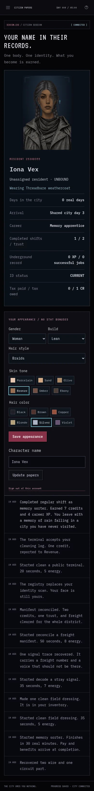
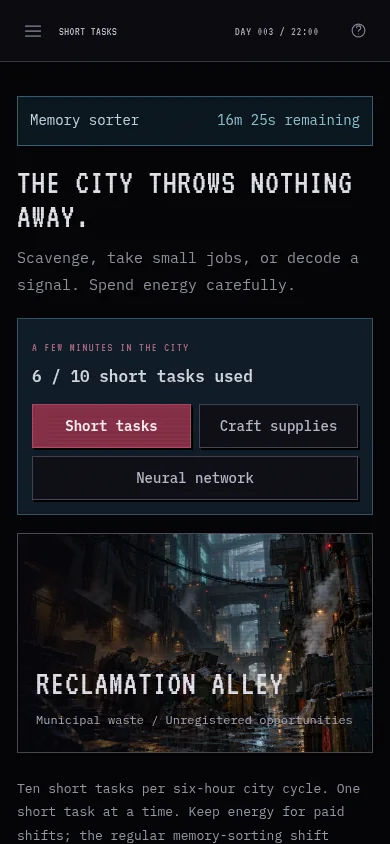
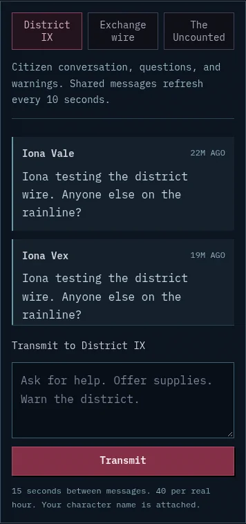
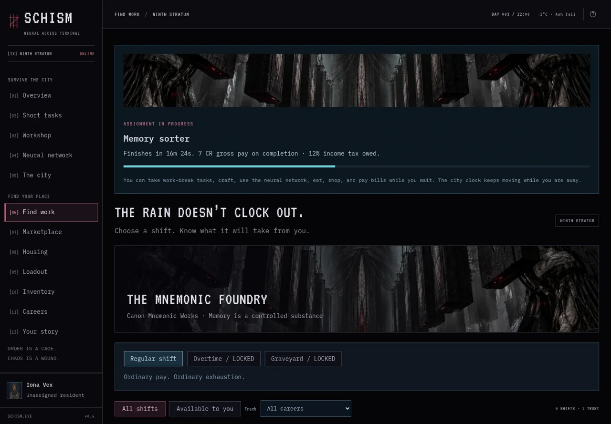
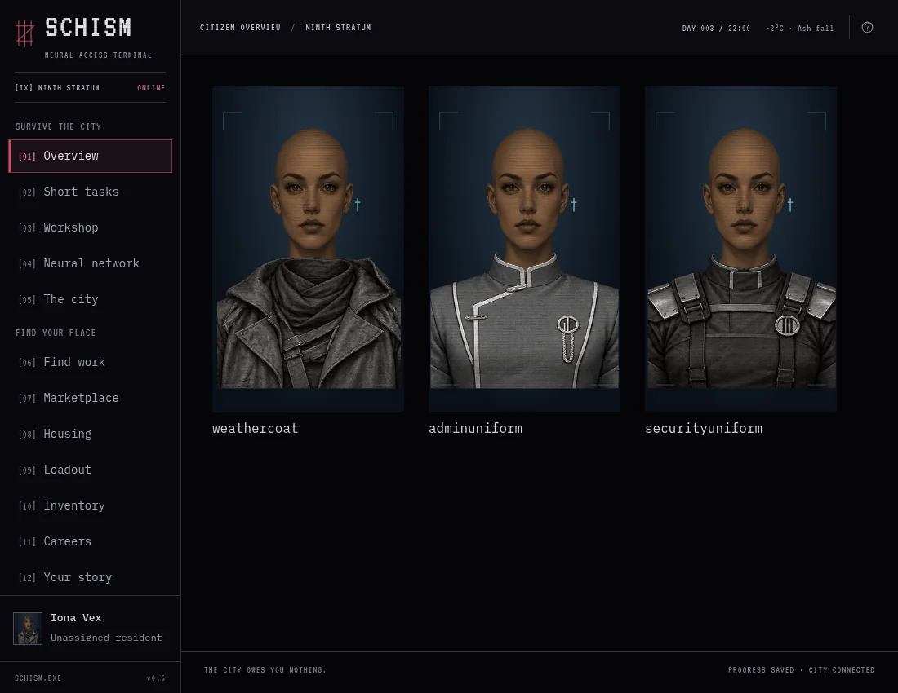

# v0.6 playtest and critique

Tested October 5, 2026, against the **same persistent local city** available to the owner's phone at http://100.89.1.14:4173. The local service uses the built production Worker and D1-compatible SQLite adapter. Tests did not bypass gameplay timers or grant resources to the played citizens.

## What I played

I created Iona Vale and Iona Vex through the mobile train intake, changed appearance, and used real 25-second scavenging and 45-second electronics recovery. Iona Vex started a normal 30-minute memory-sorting shift, crafted a field dressing during a work break, decoded a signal for 35 seconds, and completed a 50-second public freight contract. The short task and long shift remained independent. The played route used five short-task starts and ended with 2 CR and about 6 energy while shift wages remained pending.

Cato Relay and Cato Link were separate browser-session characters. They saw Iona's messages and the same city day, with separate identities and balances. The freight contract contributed to shared district state. Reloading preserved appearance and assignments; restarting the service preserved the city and signed browser session.

A separate Null Tester earned 1 CR through a real 20-second cleaning task, then staked it on a real 20-second Null House hand. The hand lost. The reserved stake stayed gone, and the player ended at 0 CR with 47 energy. Casino win/loss boundaries, repeat settlement, wager validation, and daily limits are also covered by deterministic rule checks.

## Checks and evidence

All **272 assertions** pass: 41 core, 27 narratives, 26 faction, 31 equipment/careers, 72 residency/economy, 20 reset, and 55 short-activity/network/wardrobe checks. Those checks inject server time into isolated databases to cover exact deadlines, simultaneous completions, concurrency, rollback, daily limits, tax, detention, and long progression gates. They do not alter the shared phone-test city.

Browser QA covered all 16 screens at **360px, 390px, and 1440px**, with no horizontal overflow or JavaScript page errors. Real playthroughs checked character intake, material reservation, completion, crafting alongside work, blocked off-duty scavenging while employed, shared messages, delayed wages, network contracts, and saved appearance. The server responds through its Tailscale listener and loopback; both use the same database.

Portrait inspection covers all five hairstyles on all three face types, plus civilian, administration, and security outfits. Wardrobe previews changed only the browser rendering; they did not award institutions to a played character. Administration awarding/equipping and legacy earned outfits are verified through server rules.

## Critique and changes made

The original portrait-atlas implementation was visibly wrong: filtering a nested atlas viewport exposed neighboring pieces, heads did not meet the clothing consistently, and selecting Shaved could still leave unrelated hair on the chest. The owner's phone report confirmed the same defects. Each face, hairstyle, and outfit is now a separate alpha-preserving crop. Skin and hair receive independent tint filters, Shaved creates no hair layer, and the clothing renders in front of the lower neck. Braids and the collar connection were visually checked after the correction.

The long-job-only loop left a visit with little to do after clocking in. A separate short-task slot now supports meaningful 20–75 second choices while ordinary shifts continue. Off-duty scavenging and gambling require leaving work; decoding, small terminal work, practical crafts, and network contracts fit into breaks. Costs are visible and rewards stay delayed until the short deadline.

Energy remains the harder constraint. The played five-task route nearly spent the starting energy budget despite leaving some task quota unused. Short work should supplement survival rather than bypass wages, tax, or residency gates. The UI explains that players should keep energy for paid shifts; daily relief remains a recovery option. Further balance tuning should use the owner's longer phone sessions and multi-day resource history, especially warmth, food, and how often players run out of useful actions.

The illustrated assignment initially occupied too much of every mobile screen, pushing chat and tasks down. It now collapses to a concise timer outside Find work, where the full scene remains available. A real short-task deadline also confirmed that a focused chat draft keeps its text and keyboard focus; completion refresh resumes after blur.

The new illustrations make city areas and job tracks distinct. Reusing the same track art across related jobs keeps the interface coherent, though individual specialist assignments could eventually justify their own scenes. Painted face/hair layers improve the dossier substantially; build choices currently adjust torso breadth, not a large collection of body shapes.

The network is useful even when the city is quiet: players can speak in three channels and choose public or hidden contracts. It currently uses polling and the newest 100 messages across channels; it has no private messages, offline notifications, or message search. Contracts repeat once each per city cycle. They are a first content loop, not an unlimited source of narrative variety.

The casino is intentionally a small currency sink. Odds, expected loss, stake, energy cost, and four-hand cap are shown before play. It cannot create debt or reroll a reserved outcome.

## Practical limits and reproduction

Real browser tests waited for short activities. Long deadline behavior, multi-day taxation, late administration/security requirements, and concurrency were tested with injected server time; a week-long human security career was not played. Native WebMCP remains unverified in a supporting browser. The hosted Site remains owner-private; the owner selected local shared-city QA instead of a separate hosted test login.

Use `npm test` for the rule checks. Use `npm run test:browser` with the existing local service for a repeatable real-time browser playthrough, as described in [local hosting](../LOCAL_HOSTING.md). The played citizens remain in the shared local city. Screenshots are selected evidence; ignored raw QA images and browser session state remain under `.local-data` or `/tmp/schism-qa` on this machine.
