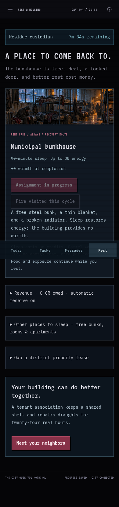
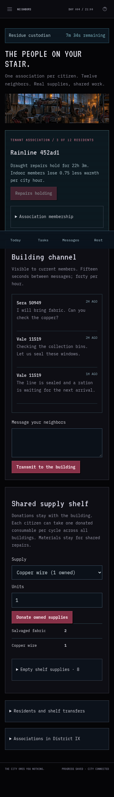
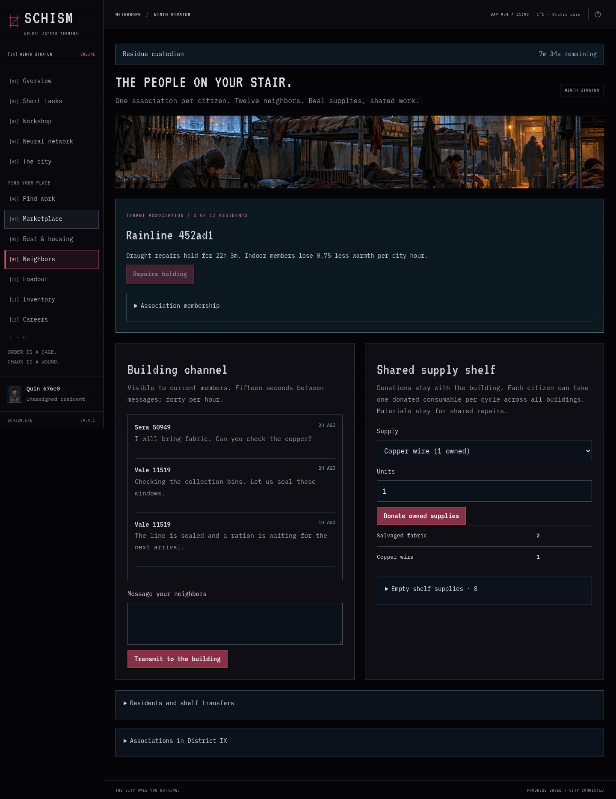

# v0.8.1 — mobile visits with Playwright MCP

October 5, 2026. This pass uses the configured Playwright MCP and its existing persistent QA citizen, Quin 676e0, in the owner's shared Tailscale city. No characters were reset. Game rules, paid housing, taxes, earned roles, stock ownership, corrected portrait layers, and migration history are unchanged.

## Changes and observed screen length

At 390×844px, the original free-housing page measured 3,214px, with its first rest button at y=739. Secondary residences and current tax controls now fold; tax debt and held IDs expand the tax section by default. Sleep controls precede descriptive copy, and mobile scene art is shorter. The final page measured 1,650px with a pending-shift strip and the first rest control at y=580. That places the control clearly above the fixed navigation dock. The Registry retains its full tax panel.

The building channel precedes the shelf in both DOM and visual order. Only stocked supplies initially occupy shelf rows; empty supplies and membership controls fold. The final mobile association page measured 2,705px after a real wire donation, with the channel starting at y=816. The earlier member view measured 3,212px and its transmit control started at y=2,823. Membership count and live activity banners changed between observations, so these are observed visits rather than a controlled timing benchmark.

Keyed sections preserve their open and closed state across ordinary refreshes, saves, and navigation in the current browser tab. A full page reload returns to sensible defaults. Today’s activity Details routes rest to housing, clearance to the Registry, crime to the underground, and ordinary shifts to work.

## Actual shared-city play

Quin warmed at the barrel on its actual 45-second timer, raising warmth from approximately 31.25 to 43.23 after exposure. Quin joined the existing Rainline 452ad1 association, retaining its already-completed repairs. A regular custodial shift started at **23:20:13.823 UTC**, with its original completion deadline **23:35:13.823 UTC** and 4 CR gross pay. The shift remained pending throughout this report; its deadline persisted through rebuilds, service restarts, and browser reloads.

During that shift, a real 20-second public-terminal task completed at **23:22:27 UTC**, paying 1 credit after spending 3 energy. Quin donated one owned copper wire: personal wire changed 2→1 and shared wire 0→1. The opened empty-stock section remained open through that save. No stock was generated. Enabling the optional automatic tax reserve persisted after reload without changing the shift deadline. Its held balance was zero because current assessed tax was zero. No building message was transmitted; the draft check remained unsent and was cleared afterward.

[Numeric evidence](v0.8.1/mcp-visits.json) records timestamps, screen measurements, and public resource changes. It contains no session cookies or signing keys.

## Verification and limits

The repeatable function in `scripts/playtest-visits-mcp.js` runs through Playwright MCP's `browser_run_code_unsafe` filename argument in the signed-in local QA tab. It uses visible navigation for all 17 screens plus character papers at 360/390/1440px: **54 measured views**, no horizontal overflow, and no JavaScript errors. Open and closed housing sections, navigation preferences, empty-stock sections, and unsent drafts pass refresh checks. Live shelf stock and assignment deadlines are unchanged by this read-only sweep.

Urgent tax defaults and four activity-link destinations are checked with temporary client-only render copies, restored before any request. They do not imply that Quin actually acquired an ID hold, committed a crime, or completed a ninety-minute sleep. Console messages reported zero errors and warnings. All **438 existing rule assertions**, Worker build/export validation, script syntax, and whitespace checks pass.

The existing living-browser harness now opens the folded Revenue section before enabling tax reserves, and retains its association ID across the final reload check, including a resumed finishing run. Its full two-citizen repair/wage route was not rerun for this interface patch; that real v0.8 evidence remains in [V0.8](V0.8.md).

This is desktop Chromium at mobile viewport widths. Actual phone hardware, a human week of ordinary visits, housing affordability, supply demand, and enjoyment still need the owner's ongoing play. The work and city pages remain roughly 8,000px and 7,300px at 390px during a pending shift. This release improves rest and neighbor visits without claiming to resolve every long screen.

## Selected screenshots

