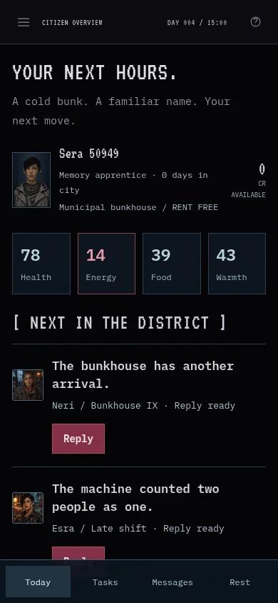
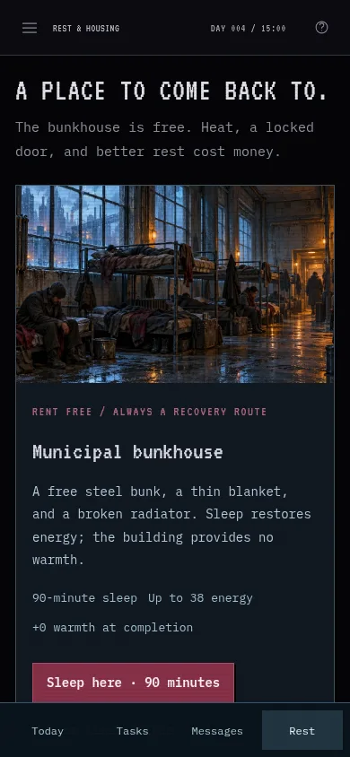
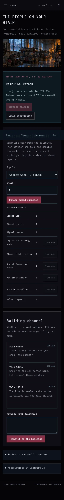
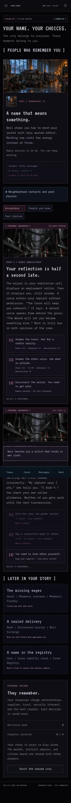
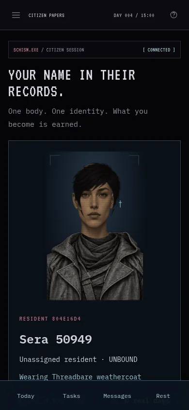
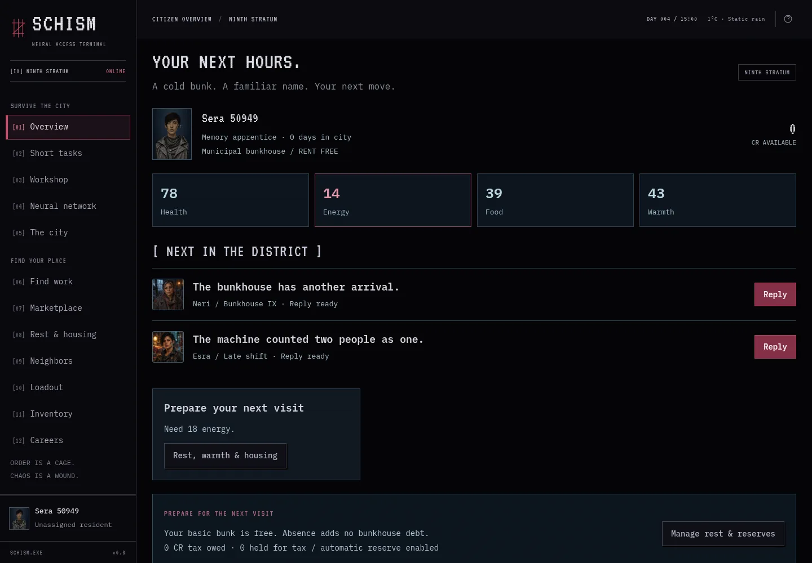
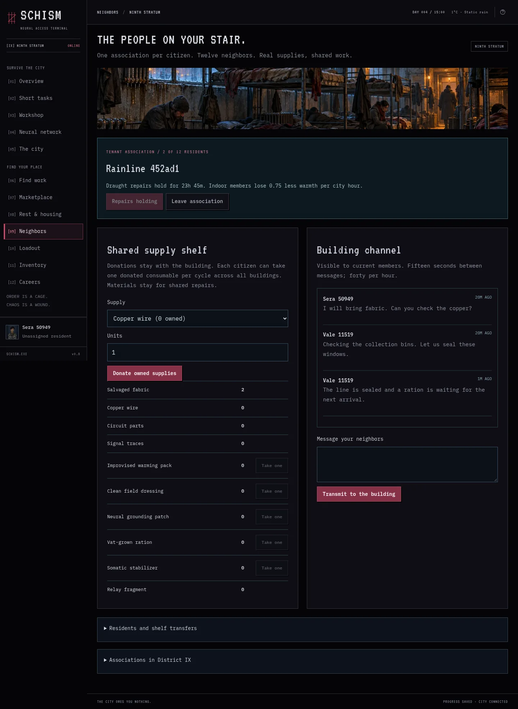

# v0.8 playtest — a place to return to

October 5, 2026. Existing characters and the owner's shared local city are preserved. The main change is a permanently free, unheated bunkhouse with a credible recovery route after absence. Shared supplies, remembered contacts, and recoverable incident damage make the city more persistent between visits.

## Rule evidence

All **438 assertions** pass: 41 core, 27 narratives, 26 factions, 31 progression, 72 residency, 20 reset, 55 street, 83 district, and 83 living. The living suite uses isolated SQLite and injected server deadlines. It covers ten-day absences, one-time old-bunk waiver versus paid debt, distinct sleep rewards, barrel completion, capped private bills, prepay/refund races, automatic tax including incoming listing income during wages, shared stock conservation, private chat, last-ration and final-member races, completed tenant repairs, historical protection windows, continuation eligibility, advocacy, mending, recovery final-slot races, immutable newspaper outcomes, and expiry.

Build and ESM artifact validation pass. The build embeds 29 original WebP assets and append-only migration 0007. Earlier migrations are unchanged. No test fixture or accelerated clock is used in the persistent phone city.

## Simulated seven-day survival

[Numeric schedules](v0.8/balance.json) come from `npm run test:balance`: ordinary registration and ordinary actions in isolated databases. Four schedules take one memory shift per visit, a small terminal task, relief/fire when needed, affordable food, and free sleep. The fifth works two shifts per cycle, takes the lattice technician job only after earning eligibility, and prepays a room only after saving its deposit and a reserve.

| Schedule | Shifts | Gross income | Food | Tax paid | Rent paid | Final credits | Housing |
| --- | --- | --- | --- | --- | --- | --- | --- |
| Daily | 7 | 64 | 35 | 7 | 0 | 22 | Free bunk |
| Twice daily | 14 | 134 | 70 | 16 | 0 | 48 | Free bunk |
| Each cycle | 28 | 282 | 194 | 33 | 0 | 55 | Free bunk |
| Missed two days | 5 | 45 | 25 | 5 | 0 | 15 | Free bunk |
| Intensive earned room | 56 | 1261 | 198 | 151 | 400 | 447 | Private room |

All finish without rent/tax debt or eviction. Daily, twice-daily, and missed-day citizens still reach the passive health floor during long gaps; ordinary relief reopens work on each return. The lighter schedules cannot treat private rent as an effortless upgrade. The intensive schedule has much better pay and many more return visits; its success is not a casual affordability claim.

These are accelerated rule simulations, not a real week of human play. The food/world state is evaluated at return rather than reconstructing historical weather. Sleep deadlines are simulated; an actual player could leave after starting sleep. This benchmark supports bounded recovery and gives an initial budget comparison. It cannot establish that returning hungry every day is enjoyable.

## Real shared-city play

Sera 50949 and Vale 11519 are ordinary arrivals in the same persistent Tailscale city used by the owner's phone. Their resources come from normal actions. They registered at the current city day, gathered fabric and copper through real 25-second bin tasks, founded/joined Rainline 452ad1, posted member messages, donated stock, and completed six actual 30-second repair units during pending 15-minute custodial shifts. The shared shelf began with six wire and eight fabric; repairs left zero wire and two fabric. Their first paid shifts remain on real server timestamps throughout testing and service restarts.

Sera used the real free barrel task. Both chose to return Neri's card and completed her original neighbor reply. A fresh ordinary Quin 676e0 separately proved the corrected original→continuation path: one real bin discovery, a 60-second original reply, the free mending lesson, and another 60-second reply. That route ran **21:36:34–21:39:05 UTC (150 seconds)** with zero credits, one short-task start, and Neri relationship 5. The lesson and finished choices persisted after reload. [Contact measurements](v0.8/contact-pacing.json) contain no session credentials.

The check caught a stale default-open directory and a recurring check-in that could consume an original contact's continuation offer too early. Both are fixed and covered by targeted checks. Existing early check-ins remain valid history; fresh offers use the corrected rule. Several harness assumptions were corrected while reusing the same characters: the 650ms action cadence, the original card's `neighbor` node, and reload preserving the current tab. These corrections did not grant goods, reset characters, or change a gameplay deadline.

Both real custodial shifts finished at **21:43 UTC**. Each character earned 6 CR including ordinary terminal work. Sera spent 6 CR on a ration and donated it; Vale withdrew it, leaving Sera with 0 CR and Vale with 6 CR plus one owned ration. Final energy was approximately 14/18, with no rent debt and one completed shift each. The association retained its six completed units and two unused fabric. An independent saved-session check verified wages, transfers, remembered replies, and persistence after the reload harness correction.

Final wage, shelf transfer, persistence, and screen measurements are in [living pacing](v0.8/pacing.json). Private storage-state files remain only under ignored `.local-data/living-playtest`. `npm run test:living-browser` provides the repeatable ordinary-character route; a post-repair interruption can resume with `SCHISM_QA_REUSE=1 SCHISM_QA_STAGE=finish`, without rewinding state.

## Visual review and critique

All 17 pages fit 360/390/1440px without horizontal overflow. Selected mobile/desktop evidence is committed below. Desktop/headless Chromium touch emulation is used; actual phone hardware is the owner's continuing test.

The compact daily screen makes vital values, pending wages, contact messages, and the next useful move much easier to find. A shorter section label avoids an isolated closing bracket on narrow screens. The new bunkhouse art communicates why free shelter is still miserable. Painted contact faces read clearly beside the terminal typography. The player sheet retains its corrected neck/collar/braids/shaved composition, and wear remains a cosmetic overlay.

The neighbors page now shows meaningful completed work and real named conversation, but its shelf, chat, and transfer log still require scrolling. Housing controls and encounter lists also remain long. The daily feed improves orientation; it does not solve every mobile content-density issue. Lazy scene images should be allowed to load before judging screenshots.

The setting and shared repair goal are stronger than the sheer number of timers. Even with short activities, a full wage still needs a later visit. The next test should measure whether people find enough worthwhile choices during that wait and whether casual players feel able to improve their living conditions. Twelve continuations and two emergency types remain a small authored content pool.

Full multi-cycle incident outcomes, week-long progression, paid housing, and late-role uniforms are verified with isolated rules/simulations or earlier client-only visual previews. They are not claimed as a real human week or newly earned security appointment. Global offline weather remains approximate; tenant protection uses exact historical windows. No public hosted audience change, direct player arrest, external AI conversation, or real-time combat is implied.

## Selected screenshots

