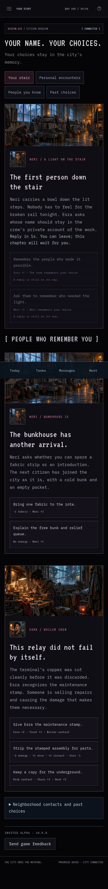

# v0.9 — prepared for an invited alpha

October 5, 2026 local time; final checks crossed into October 6 UTC. The owner authorized the recommended story, mobile and alpha-readiness work. This release preserves all citizens, the existing private audience, earned roles, free bunks, and corrected portrait layers.

## A complete first session

**A light on the stair** introduces Neri and Esra, a missing repair allocation, and a political choice with lasting relationships and distinct epilogues. Inspection and repair run on real 30/45-second deadlines. Repair consumes actual copper and fabric from owned inventory or the association shelf. Its news entry begins at completion and respects the quiet route's choice to withhold the actor's name. The next-cycle reply and four first-week milestones give players a reason to return.

An ordinary isolated rules test completes the opening within ten minutes through actual registration/actions with injected deadlines, without fixture supplies. Separately, a fresh Playwright MCP citizen **Ada v09 MCP** repaired the lamp in **3m47s of real elapsed time** with two fabric from a 30-second textile task and copper from a 45-second salvage task. One wire/fabric remained, trust became two, credits stayed zero, and approximately 44 energy remained. The player then started an 8-CR memory shift and chose to preserve the missing work record. Its original **01:42:21.760 UTC October 6** deadline stayed fixed; its trust/contact bonus and wages were pending at observation. The stair epilogue waits until **06:00 UTC**. Their later completion is proved by isolated rule tests, not claimed as a real-time observation here.

The initial real route caught a too-fast registration-to-story click hitting the existing 650ms server guard. Controls now remain disabled through that interval. The city subpage check caught missing local variables after splitting newspaper/recovery, and the private-report test caught a shared dialog container being replaced. Both were repaired and their complete affected flows were rerun successfully.

## Real cooperation, reporting and recovery

Ada joined the existing Rainline association and requested one wire for the next draught repair. Quin contributed an owned unit: personal wire **1→0**, shared wire **1→2**, request fulfilled. Combined stock stayed two. No inventory was generated. A private report on an explicitly marked test transmission reached the configured local operator. Hiding it removed it for its author and the reader; the ordinary player had no report queue. A player feedback note was read and acknowledged through the same working confirmation dialog. The 24-hour posting timeout is checked in isolation; no real citizen was muted in this pass.

The operator downloaded the live game-data export and restored it into a **separate 17-citizen SQLite database**. Character JSON, the pending work deadline, shared stock, and moderation matched exactly; integrity was `ok`. The running city was untouched. The export and its identities stay ignored/private. Earlier, the local SQLite file was backed up before migration. Hosted D1 restoration has not been rehearsed and still requires supported provider tools.

## Mobile scope and measurements

The main-screen MCP sweep checks **54 views**: 17 navigation screens and papers at 360/390/1440px, no overflow or JavaScript errors. A separate **33-view** check exercises every task/city/story subpage at the same widths and verifies that opening feedback does not break later action confirmation. Existing disclosure retention, urgent-tax defaults, activity links and unsent building drafts still pass.

| Default 390px visit | Observed height |
| --- | ---: |
| Work, available shifts on current career | 1,574px |
| City conditions | 2,384px |
| Short tasks, materials | 2,513px |
| Rest & housing | 1,768px; sleep control y=498 |
| Neighbors | 2,955px; channel y=836 |

The prior v0.8.1 pending-shift observations placed work and city near 8,000/7,300px. These are different observed visits and default selections, not a controlled usability experiment. Explicitly selecting all careers or opening long personal encounters still exposes the full content. Actual phone hardware and human ease of use remain unproven.

## Automated verification and lab capacity

All **497 rule assertions** and **15 built-Worker API checks** pass, including timed rewards, replay protection, ordinary material access, shared-request races/conservation, private member reporting, moderation authorization, timeout/gameplay separation, request limits, origin/input checks, and isolated backup restoration. Build/ESM export validation and whitespace checks pass. Migration 0008 adds six tables without editing earlier migrations.

The isolated built-Worker/SQLite load probe uses twenty concurrent ordinary citizens. It completed **460 requests**, zero failures, p50 **35.98ms**, p95 **51.74ms**, p99 **54.32ms**. Wages stayed deferred and no stale action guards remained. [Numeric load result](v0.9/load.json) explicitly labels this environment: these are local in-memory adapter timings, not internet latency, hosted D1 performance, or production-scale proof. [MCP evidence](v0.9/mcp-evidence.json) contains public numeric observations without credentials or backups.

## What remains before broad publication

Use [the alpha guide](../ALPHA_TEST.md) for 10–20 named testers over one or two real weeks. Observe first-session clarity, desire to return, missed-day recovery, private-room affordability and real supply-request demand. Configure actual operator monitoring/alerting and rehearse hosted recovery. Global weather settlement is still approximate and the authored story pool remains finite. Tester addresses and an optional custom hostname were requested but not supplied during this build; the hosted audience stays owner-private.
